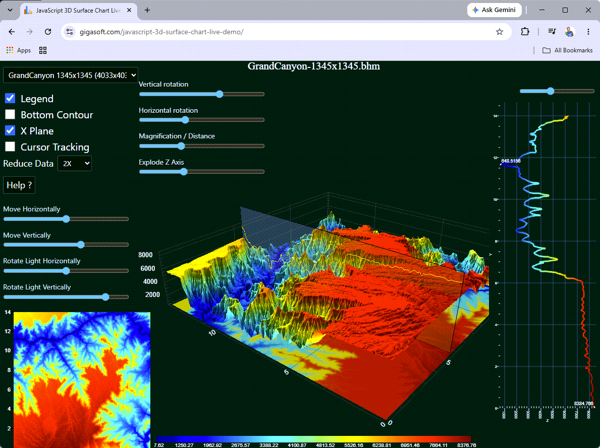

# GigaPrime3D Wasm -- JavaScript 3D Surface and Contour Chart on WebGPU

**3D surfaces and contours from real height-map data, rendered on WebGPU.**

---




**See this repo live now in your browser: [click here](https://gigasoft.com/javascript-3d-surface-chart-live-demo/)**

If you like what you see, we'd appreciate a star -- it helps more
than you realize.

The same `Pe3do` scientific graph object that ships on the desktop, with its own
popup menu, scrollbars and zoom -- rotate it, zoom it, switch data sets.

* **A desktop engine, not a web library.** The same native C++ engine
  Gigasoft has shipped since 1995 -- running inside instrumentation, SCADA,
  medical and test-and-measurement products -- compiled to WebAssembly.
* **The JavaScript property names are the WinForms property names.** If you
  have used ProEssentials on the desktop, you already know the API. AI assisted
  with our pe_query.py Ai-Data repo for ground truth intelligence based on
  our WinForms.
* **Compute shaders feeding compute shaders, and a zero-copy path.** The chart
  is handed a pointer into the WebAssembly heap, and GPU stages consume each
  other's output without returning to the CPU. This is full-data-replacement
  work: large line data, 3D surfaces, 2D contours, where the whole dataset
  changes every frame. A charting engine designed by electrical engineers,
  engineered to the nth degree. ProEssentialsJS is not just faster, it's
  magnitudes faster.
* **No WebGL context limit.** Canvas2D is not a GPU context, so putting many
  charts on one page does not run into the browser's cap. The GPU is engaged
  where the chart needs it.
* **Free for commercial use under USD 250,000 revenue**, redistribution
  included. No licence key, no activation, no domain lock, no phone home, no
  watermark.

## Run it

```
git clone https://github.com/GigasoftInc/proessentials-js-gigaprime3d.git
cd proessentials-js-gigaprime3d
npm start
```

Then open the address it prints. **Nothing to install** -- the server is one
file with no dependencies, and the library is committed here.

**WebGPU needs a secure context.** `http://localhost` is one; a LAN address like
`http://192.168.1.10` is not, and `navigator.gpu` is simply undefined there. The
chart still draws through Canvas2D, so the failure is quiet and looks like a
driver problem. Serve over HTTPS or use localhost.

## What a page needs

Two tags:

```html
<script src="./lib/proessentials.iife.js"></script>
<script type="module" src="./app/main.js"></script>
```

The first is the whole runtime, including the 3D/WebGPU layer. The second is
the application, which imports the facade it needs as an ordinary ES module.

## Editor intellisense

Works with no configuration. The facade declarations reference the rest.

## Where to go next

| | |
|---|---|
| start here | [proessentials-js-starter](https://github.com/GigasoftInc/proessentials-js-starter) -- the smallest chart, the file to read first |
| every example | [proessentials-js-demo](https://github.com/GigasoftInc/proessentials-js-demo) -- 120 examples with the source beside each |
| large data | [proessentials-js-gigaprime2d](https://github.com/GigasoftInc/proessentials-js-gigaprime2d) -- millions of points, replaced every frame |
| 3D | [proessentials-js-gigaprime3d](https://github.com/GigasoftInc/proessentials-js-gigaprime3d) -- surfaces and contours on WebGPU |
| your AI | [proessentials-ai-data](https://github.com/GigasoftInc/proessentials-ai-data) -- ground truth for an AI assistant: property paths, enums, 116 examples |
| the product | <https://www.gigasoft.com> -- documentation, pricing, the walkthrough |

## Licence and support

**Free for commercial use, including redistribution, by organizations under
USD 250,000 annual gross revenue** -- no watermark, no feature gates, no
expiry. Above that, prices are published through to the largest buyer; a licence
is perpetual, paid once and royalty free.

See [PEJS-LICENSE.md](PEJS-LICENSE.md), [THIRD-PARTY-NOTICES.md](THIRD-PARTY-NOTICES.md)
and <https://www.gigasoft.com/license>.

**Support is free and unlimited, answered by the people who wrote the engine:
<https://www.gigasoft.com/contact>.** Issues are turned off on this repository
so that every question reaches somebody who can answer it.
